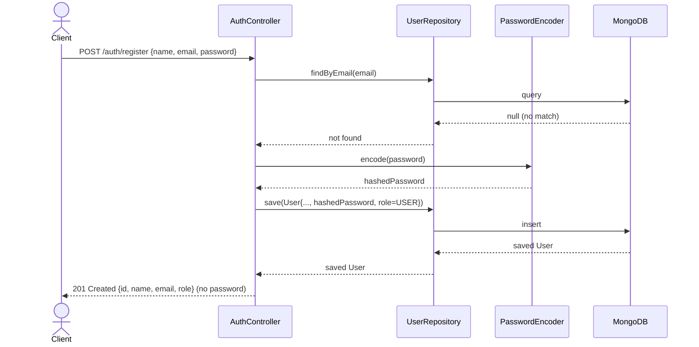
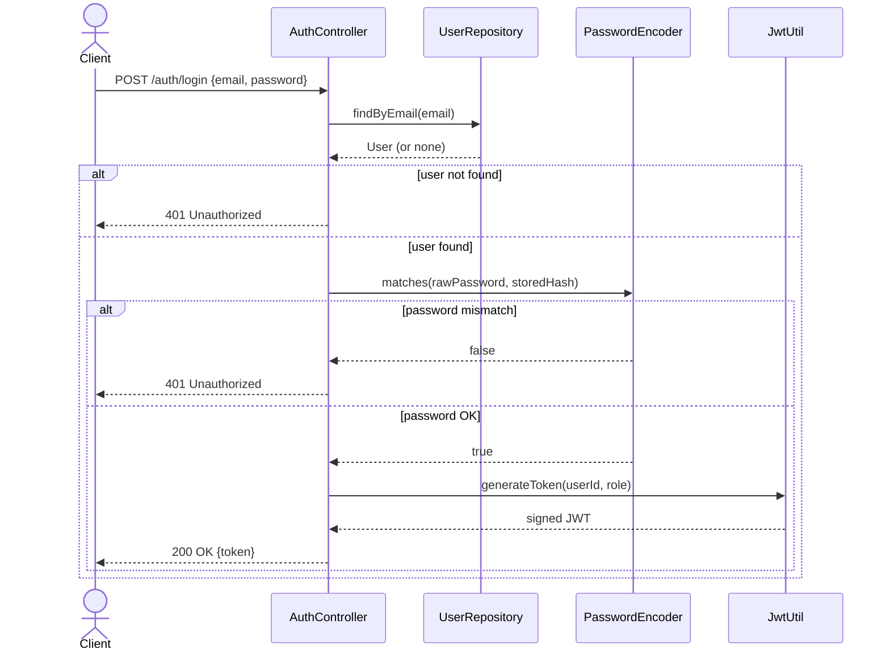
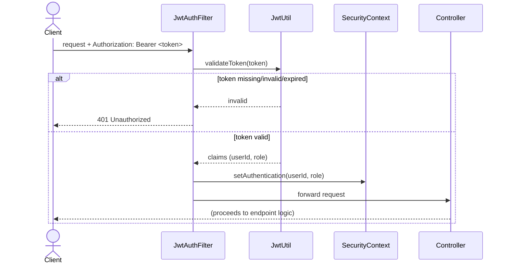
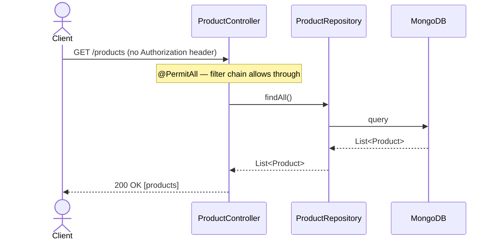
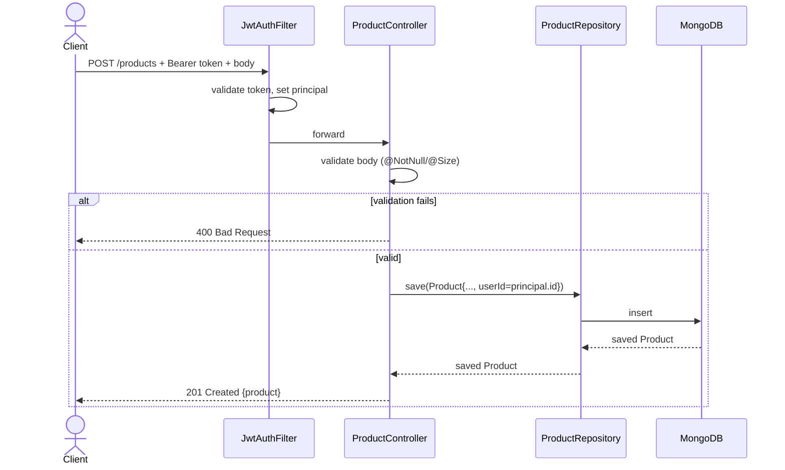
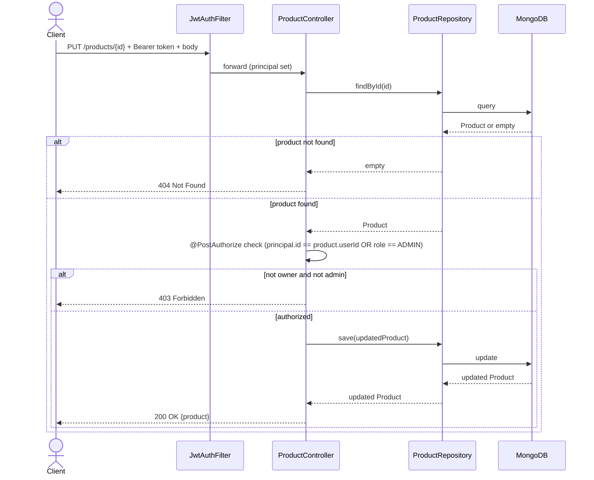
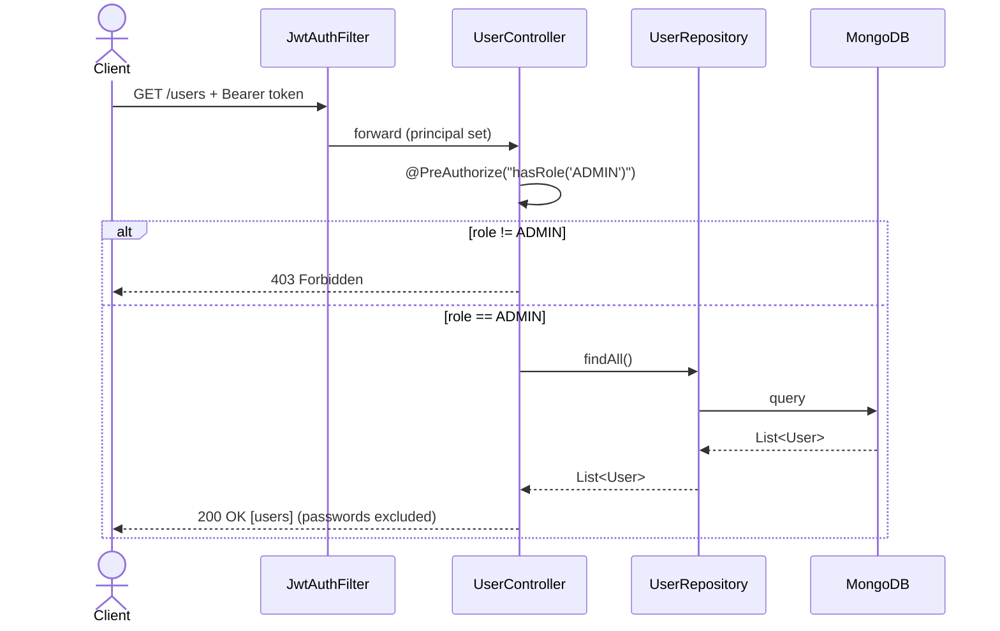
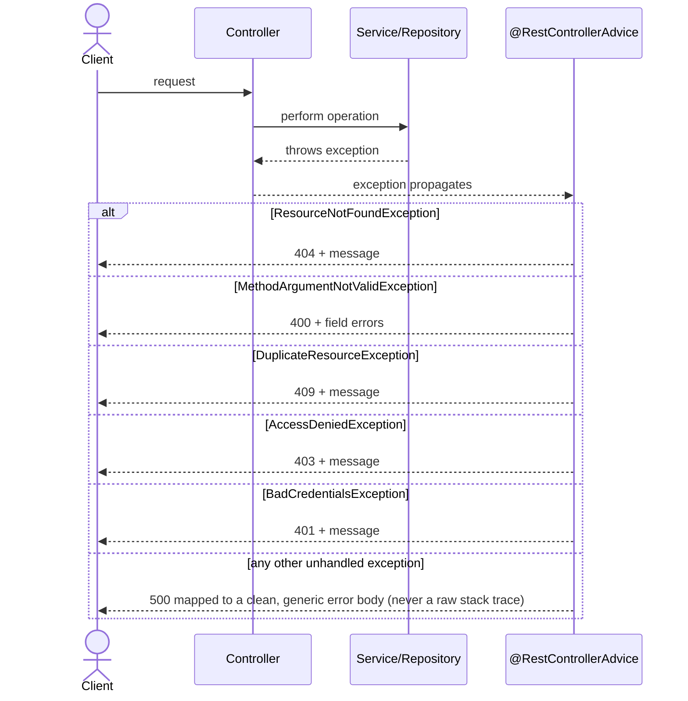

# Let's Play — Sequence Diagrams

Oriented flows for the core scenarios the audit will actually walk through.

---

## 1. Registration

---

## 2. Login (JWT issuance)

---

## 3. Authenticated Request Filter Chain

Every protected endpoint passes through this before reaching the controller.

---

## 4. Get Products (public, no auth)

---

## 5. Create Product (authenticated user)

---

## 6. Update/Delete Product (owner-or-admin check)

---

## 7. Admin Lists Users

---

## 8. Global Exception Handling (any endpoint)

